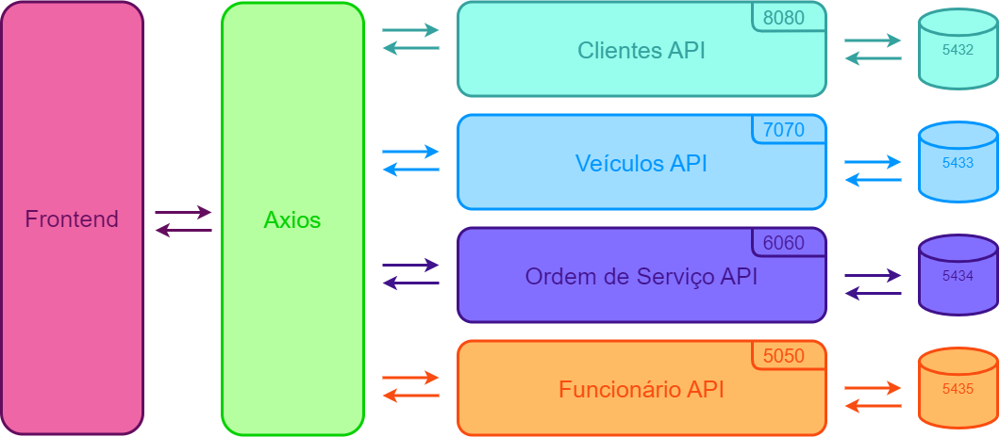
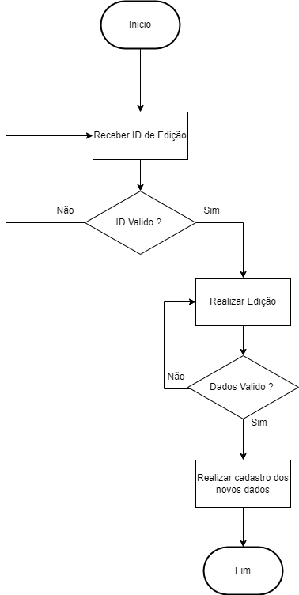

# 📘 Gestão de Oficina Mecânica

## 📌 Sumário
- [Visão Geral do Projeto](#📌-visão-geral-do-projeto)
- [Arquitetura do Sistema](#⚙️-arquitetura-do-sistema)
- [Tecnologias Utilizadas](#🛠-tecnologias-utilizadas)
- [Frontend](#frontend)
- [Configuração e Execução do Projeto ](#🚀-configuração-e-execução-do-projeto)
- [Endpoints da API](#📄-endpoints-da-api)
- [Estrutura do Projeto](#📂-estrutura-do-projeto)
- [Fluxo do Sistema Cadastro](#🔍-fluxo-do-sistema-cadastro)
- [Fluxo do Sistema Edição](#🔍-fluxo-do-sistema-edição)
- [Boas Práticas e Padrões](#🛠-boas-práticas-e-padrões)
- [Contato](#📚-contato)

---

## 📌 Visão Geral do Projeto
O sistema de **Gestão de Oficina Mecânica** tem como objetivo facilitar o gerenciamento de clientes, veículos, ordens de serviço e funcionários, proporcionando eficiência no atendimento e na execução dos serviços.

O projeto segue uma arquitetura baseada em **microserviços**, utilizando tecnologias modernas para garantir escalabilidade e performance.

---

## ⚙️ Arquitetura do Sistema
O sistema é composto pelos seguintes microserviços:
- **Clientes API**: Cadastro e gerenciamento de clientes.
- **Veículos API**: Controle de veículos associados a clientes.
- **Ordem de Serviço API**: Registro e acompanhamento das ordens de serviço.
- **Funcionários API**: Gerenciamento de mecânicos e funcionários.

A comunicação entre os serviços ocorre via **REST API**, utilizando **Axios** para integração.



---
## 📊 Diagrama de Entidade-Relacionamento (DER)
O Diagrama de Entidade-Relacionamento (DER) do sistema de Gestão de Oficina Mecânica modela a estrutura do banco de dados e as relações entre os principais elementos do sistema:

Clientes: Armazena dados pessoais e a quantidade de veículos do cliente.
Veículos: Associados a um cliente, possuem atributos como placa, tipo, status e marca.
Ordens de Serviço: Registram os serviços prestados, incluindo data, descrição, status e funcionários envolvidos.
Funcionários: Representam os mecânicos e técnicos responsáveis pelos serviços, contendo dados como cargo, especialidade e anos de experiência.

.png)

## 🔗 Relacionamentos

Um cliente pode possuir vários veículos.
Cada veículo pode ter apenas uma ordem de serviço ativa.
Uma ordem de serviço pode ter vários funcionários trabalhando nela.

---
## 🛠 Tecnologias Utilizadas
- **Frontend**: React, Next.js, Material UI
- **Backend**: Java, Spring Boot
- **Banco de Dados**: PostgreSQL
- **Comunicação**: REST API (Axios)


---

## Frontend 

Inicialmente, foi criado um design no Figma para ser utilizado como base, utilizando as seguintes cores:

- **#08005B** (azul escuro) 
- **#FFFFFF** (branco)
- **#E9E9E9** (cinza claro)


No entanto, durante o desenvolvimento do projeto, algumas alterações foram necessárias.

### Dashboard

A dashboard é a tela onde são exibidas informações importantes, como:

- **Cards** que mostram a quantidade de registros de cada serviço.
- **Tabelas simples:**
  - **Tabela de veículos**: Exibe o tipo de veículo (Carro, Moto ou Caminhão) e o status (Espera, Manutenção, Liberado).
  - **Tabela de clientes**: Exibe a quantidade de veículos que cada cliente possui.
- **Cards** adicionais:
  - Cards que mostram a quantidade de O.S (Ordens de Serviço) abertas e fechadas.
  - Cards com os **últimos cadastros** de Ordem de Serviço, Cliente e Veículo.


### Menu
Em todas as telas de menu, segue o mesmo padrão, com três opções principais:

1. **Realizar um Novo Cadastro**
2. **Gerenciar** (onde ficam as tabelas de dados)
3. **Edição**


### Tela de Edição

Na tela de edição, segue o mesmo padrão de estilo, com o primeiro campo sendo a busca pelo ID.


### Tela da Tabela
A tabela exibe no máximo 5 cadastros por página. Após esse limite, uma nova página é gerada, e em cada página há a opção de apagar os dados.


## 🚀 Configuração e Execução do Projeto
### 1️⃣ **Clone o Repositório**  
Primeiro, baixe o código-fonte do projeto executando o seguinte comando no terminal:  

```bash
git clone https://github.com/Augustoo22/API_Microservices.git
```
Em seguida, entre na pasta do projeto:  

```bash
cd API_Microservices
```

### 2️⃣ **Instale Dependências Essenciais**  
Se ainda não tiver o **Docker** e o **PostgreSQL** instalados, siga as instruções abaixo:  

- **[Instalar Docker](https://docs.docker.com/get-docker/)** 
- **[Instalar PostgreSQL](https://www.postgresql.org/download/)** 


### 3️⃣ **Rodando o Projeto**  
Abra o projeto na sua IDE (VS Code, IntelliJ, etc.) e execute o seguinte comando no terminal para iniciar os containers:  

```bash
docker-compose up --build
```
Esse comando irá:  
✅ Construir e rodar os containers necessários (Banco de Dados, Backend, etc.)  
✅ Criar as tabelas automaticamente no PostgreSQL  
✅ Expor os endpoints da API para o frontend  

### 4️⃣ **Acesse a Aplicação**  
Após a inicialização, abra o navegador e acesse:  

```bash
http://localhost:3000/inicio
```


---

## 📄 Endpoints da API

### **Clientes API**
| Método | Endpoint              | Descrição                  |
|--------|-----------------------|----------------------------|
| GET    | `/api/clientes`       | Lista todos os clientes    |
| POST   | `/api/clientes`       | Adiciona um novo cliente   |
| GET    | `/api/clientes/{id}`  | Retorna um cliente por ID  |
| PUT    | `/api/clientes/{id}`  | Atualiza dados do cliente  |
| DELETE | `/api/clientes/{id}`  | Remove um cliente          |

### **Funcionarios API**
| Método | Endpoint              | Descrição                      |
|--------|-----------------------|--------------------------------|
| GET    | `/api/funcionarios`       | Lista todos os funcionarios|
| POST   | `/api/funcionarios`       | Adiciona um novo funcionario|
| GET    | `/api/funcionarios/{id}`  | Retorna um funcionario por ID|
| PUT    | `/api/funcionarios/{id}`  | Atualiza dados do funcionario|
| DELETE | `/api/funcionarios/{id}`  | Remove um funcionario        |

### **Ordem de Serviço API**
| Método | Endpoint              | Descrição                  |
|--------|-----------------------|----------------------------|
| GET    | `/api/ordensServico`       | Lista todos os Ordem de Serviço|
| POST   | `/api/ordensServico`       | Adiciona um novo Ordem de Serviço|
| GET    | `/api/ordensServico/{id}`  | Retorna um Ordem de Serviço por ID  |
| PUT    | `/api/ordensServico/{id}`  | Atualiza dados do Ordem de Serviço  |
| DELETE | `/api/ordensServico/{id}`  | Remove um Ordem de Serviço          |

### **Veiculos API**
| Método | Endpoint              | Descrição                  |
|--------|-----------------------|----------------------------|
| GET    | `/api/veiculos`       | Lista todos os veiculos    |
| POST   | `/api/veiculos`       | Adiciona um novo veiculo   |
| GET    | `/api/veiculos/{id}`  | Retorna um veiculo por ID  |
| PUT    | `/api/veiculos/{id}`  | Atualiza dados do veiculo  |
| DELETE | `/api/veiculos/{id}`  | Remove um veiculo          |

---


## **📂 Estrutura do Projeto**

#### **Backend (Java/Spring Boot)**
```
/backend
  /cliente
  /funcionario
  /ordemServico
  /veiculo
```

#### **Frontend (React/Next.js)**
```
/frontend
  /public
  /src
    /app
    /components
    /config
  .gitignore
  Dockerfile
  eslint.config.mjs
  next.config.ts
  package.json
  package-lock.json
  postcss.config.mjs
  README.md
  tailwind.config.ts
  tsconfig.json
```

---

## 🔍 Fluxo do Sistema Cadastro
1. Cadastro de clientes
2. Cadastro de veículos
3. Cadastro de ordens de serviço
4. Cadastro de funcionario


---

## 🔍 Fluxo do Sistema Edição
1. Edição de clientes
2. Edição de veículos
3. Edição de ordens de serviço
4. Edição de funcionario



---

## 🛠 Boas Práticas e Padrões
- Código limpo e modular
- Uso de controllers, services e repositories no backend
- Versionamento com Git

---

## 📚 Contato
- **[Linkedin](https://www.linkedin.com/in/victor-augusto-2b01a71a6/)** 

---
